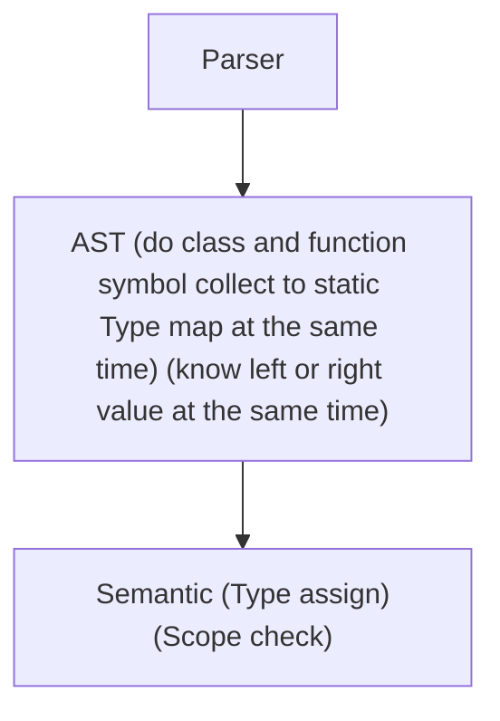

```mermaid
graph TD
    A[Parser] --> B["AST (do class and function symbol collect to static Type map at the same time) (know left or right value at the same time)"] --> C["Semantic (Type assign)(Scope check)"]
```
